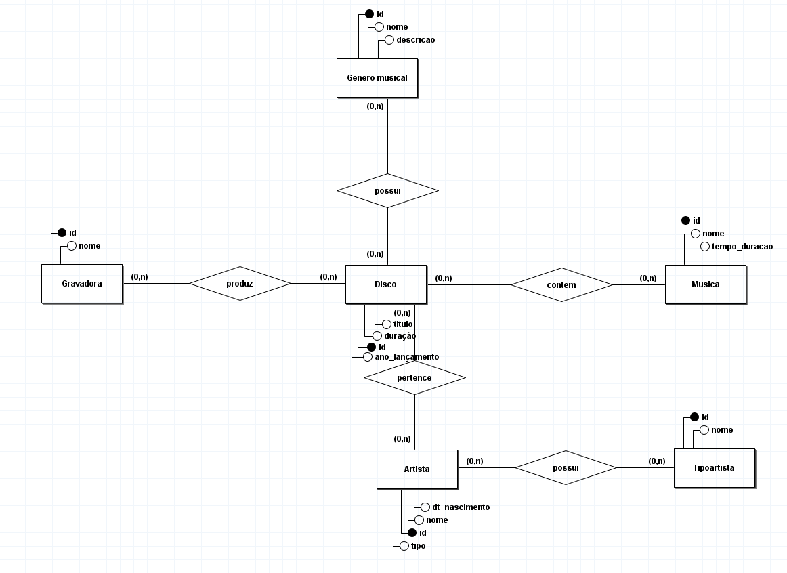
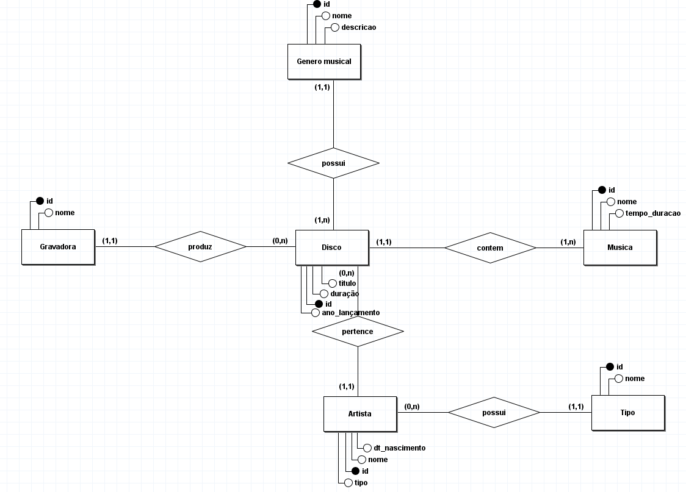
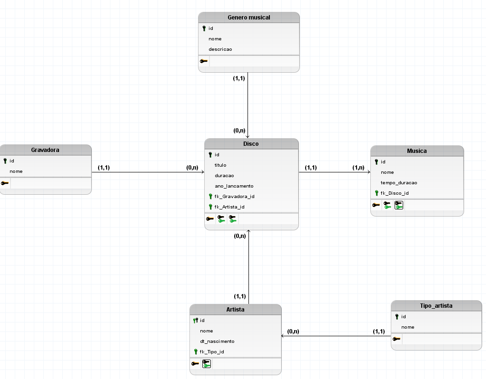
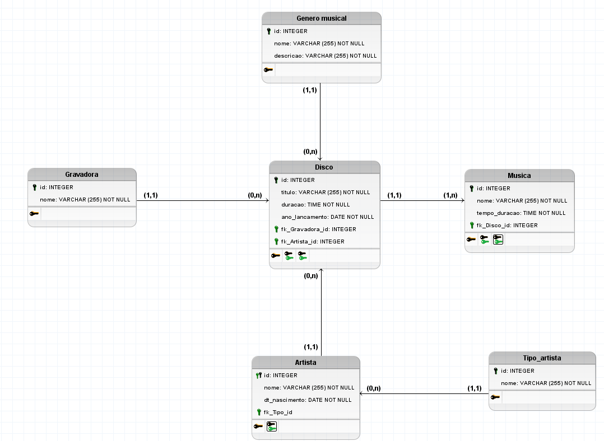

# Modelagem de uma discoteca para catalogar sua coleção

## Regra de negócios / Requisitos

Uma discoteca gostaria de catalogar sua coleção, e para isso contratou uma empresa pequena para criar seu sistema. Após uma longa entrevista com o analista de requisitos o mesmo chegou na seguinte regra de negocio relevante para o dono da discoteca. Todos os seus discos devem conter id, titulo, duração, ano de lançamento, o artista, e a gravadora que produziu e publicou cada disco, sendo que é relevante saber também quais são as musicas de cada disco e seu gênero musical, entenda como artista a banda, o conserto, a dupla ou o artista solo, porém para artistas solo deve-se saber além do nome a sua data de nascimento, ja para as musicas é necessário saber o nome e tempo de duração. As musicas somente podem estar em um único disco e nenhum disco deve ser cadastrado sem suas musicas, gravadoras podem ser cadastradas mesmo que não possuam discos associados a ela. Deve ser possível registrar artistas sem disco e o disco deve conter
apenas um artista associado a ele.

## Modelo conceitual DER (1.0)

Apresentando somente as relações e seus atributos.

​	
## Modelo conceitual DER (1.1)

Incluindo as cardinalidades pertinentes a regra de negócio para atender o mundo real.

## Modelo lógico DER (1.0)

Não apresenta a tipificação do campo.

## Modelo lógico DER (1.1) 

Contém agregação de tipos e restrições.

 
 
## Scripts mySQL

**SCRIPT CREATE** - envolve as criações das tabelas.

[SCRIPT CREATE](<../../script create.sql>)

**SCRIPT INSERT** - envolve a inserção de dados nas tabelas.

[SCRIPT INSERT](<../../scrip insert.sql>)

[voltar](../readme.md)